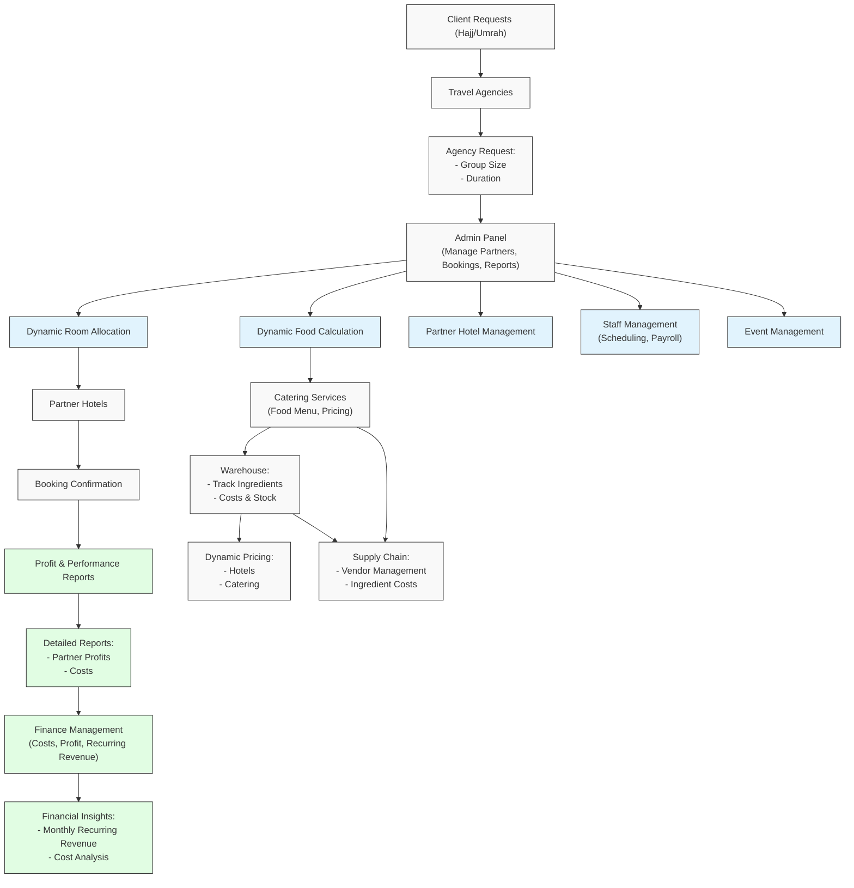

# Hajj & Umrah Management Platform

## 🌟 Overview

Welcome to the Hajj & Umrah Management Platform! This enterprise-grade solution streamlines the entire process of managing religious travel services, from initial booking to financial reporting. Our platform serves as a central hub connecting travel agencies, hotels, and catering services while providing robust financial insights.

## 🎯 Core Features

- **Smart Booking Management**: Automated room allocation and group management
- **Dynamic Pricing Engine**: Real-time price adjustments based on market conditions
- **Integrated Catering System**: Complete food service management with inventory tracking
- **Financial Analytics**: Comprehensive reporting and business intelligence
- **Staff & Event Coordination**: Streamlined resource management

## 📊 System Architecture

Below is our complete platform workflow showing how different components interact:



## 🚀 Getting Started

## 📦 Dependency Management

Our project uses a structured approach to managing dependencies across different environments:

### 📄 Requirements Files Structure

- **`base.txt`**:
  - Core dependencies required across all environments.
  - Foundation for all other requirement files.
  - Contains essential packages for basic functionality.

- **`dev.txt`**:
  - Developer-specific tools and libraries.
  - Extends `base.txt`.
  - Includes debugging tools and development utilities.
  - Recommended for local development.

- **`test.txt`**:
  - Testing-related dependencies.
  - Extends `base.txt`.
  - Contains testing frameworks and assertion libraries.
  - Used in CI/CD pipelines.

- **`prod.txt`**:
  - Production-specific dependencies.
  - Extends `base.txt`.
  - Includes optimized libraries and production servers.
  - Example: gunicorn, optimized database connectors.

- **`local.txt`** *(Optional)*:
  - For local overrides or private dependencies.
  - Extends `dev.txt`.
  - Perfect for team-specific or developer-specific packages.
  - Not tracked in version control.


### Prerequisites

- Python 3.12+
- Django 3.3.1
- PostgresSQL 16+
- Redis 7+

### Installation

1. Clone the repository:
```bash
git clone git@github.com:Saudi-Arabia-Pilgrim/Catering.git
cd catering
```

2. Set up the virtual environment:
```bash
python -m venv venv
source venv/bin/activate  # On Windows: venv\Scripts\activate
```

3. Install dependencies:
```bash
pip install -r requirements/dev.txt
```

4. Configure environment variables:
```bash
cp .env.example .env
# Edit .env with your configuration
```

5. Initialize the database:
```bash
python manage.py migrate
python manage.py createsuperuser
```

6. Start development servers:
```bash
# Terminal 1: Backend
python manage.py runserver
```

## 👥 Team Structure & Responsibilities

### Project Management
- **Project Manager**: Mukhsin Mukhtorov
  - Strategic planning and roadmap development
  - Sprint planning and backlog grooming
  - Stakeholder communication
  - Resource allocation

### Development Teams

#### Backend Team
- **Lead**: Oybek Yo'ldoshev
- **Responsibilities**:
  - Core API development
  - Database optimization
  - Service integration
  - Performance monitoring

#### Frontend Team
- **Lead**: Alisher
- **Responsibilities**:
  - User interface development
  - Component library maintenance
  - Responsive design implementation
  - Performance optimization

#### DevOps Team
- **Lead**: Mukhsin Mukhtorov
- **Responsibilities**:
  - CI/CD pipeline management
  - Infrastructure maintenance
  - Security implementation
  - Monitoring and alerts


## 📅 Sprint Schedule

We operate in 2-week sprints with the following recurring events:

- **Sprint Planning**: Monday (Sprint Start) - 10:00 AM
- **Daily Standups**: Every weekday - 18:30 PM
- **Sprint Review**: Friday (Sprint End) - 2:00 PM
- **Sprint Retrospective**: Friday (Sprint End) - 3:30 PM

## 🔄 Development Workflow

1. **Branch Naming Convention**:
   - Feature: `feature/JIRA-123-short-description`
   - Bugfix: `bugfix/JIRA-123-short-description`
   - Hotfix: `hotfix/JIRA-123-short-description`


2. **Commit Message Format**:
```
[JIRA-123] Category: Brief description

- Detailed bullet points
- Of changes made
```

3. **Pull Request Process**:
   - Create PR with template
   - Assign reviewers
   - Pass CI checks
   - Obtain 2 approvals
   - Merge using ```merge pull request```

## 📈 Monitoring & Performance

- Application Performance: New Relic
- Error Tracking: Sentry
- Log Management: ELK Stack
- Uptime Monitoring: Pingdom

## 🔒 Security & Compliance

- Regular security audits
- OWASP compliance
- Data encryption at rest and in transit
- Regular penetration testing
- GDPR compliance measures

## 🎯 Current Sprint Goals (Sprint 1)

1. Implement dynamic pricing algorithm
2. Optimize room allocation system
3. Enhance reporting dashboard
4. Implement multi-language support

## 📞 Support & Contact

- **Technical Issues**: Create a GitHub issue
- **Security Concerns**: ```mukhsinmukhtorov@arizona.edu```
- **Emergency Contact**: +998993233528

## 📝 Contributing

1. Fork the repository
2. Create your feature branch
3. Commit your changes
4. Push to the branch
5. Create a Pull Request

## 📜 License

This project is licensed under the No Licenses - see the [LICENSE.md](LICENSE) file for details.

---

*Last updated: November 18, 2024*